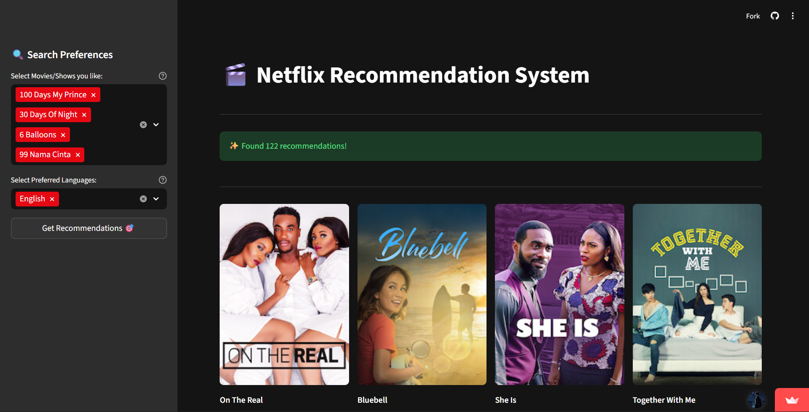
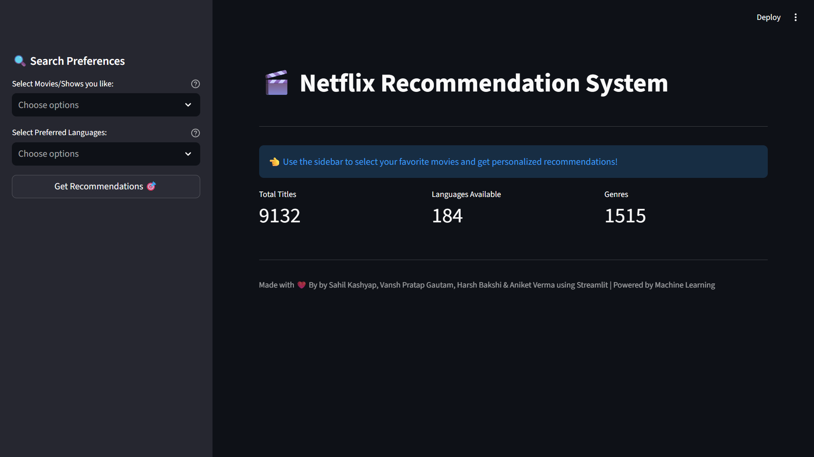

# 🎬 Netflix Recommendation System

A smart movie and TV show recommendation system built with Streamlit and Machine Learning.



## 🌟 Live Demo

**[Try it now!](https://sahilkashyap263-netflix-recommendation-system-stream-app-d3j2i5.streamlit.app/)**



## ✨ Features

- Select up to 5 movies/shows you like
- Get personalized recommendations based on content similarity
- Filter by preferred languages
- View IMDb scores and movie details
- Beautiful grid layout with posters

## 🛠️ Tech Stack

- Streamlit
- Pandas
- Scikit-learn
- Python 3.8+

## 🚀 Installation

```bash
git clone https://github.com/yourusername/netflix-recommendation-system.git
cd netflix-recommendation-system
pip install -r requirements.txt
streamlit run streamlit_app.py
```

## 📦 Requirements

```txt
streamlit==1.29.0
pandas==2.1.3
scikit-learn==1.3.2
numpy==1.24.3
```

## 👥 Team

Made with ❤️ by Sahil Kashyap, Vansh Pratap Gautam, Harsh Bakshi & Aniket Verma

---

⭐ Star this repo if you found it helpful!