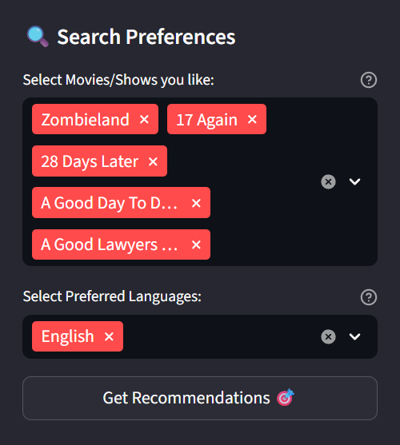
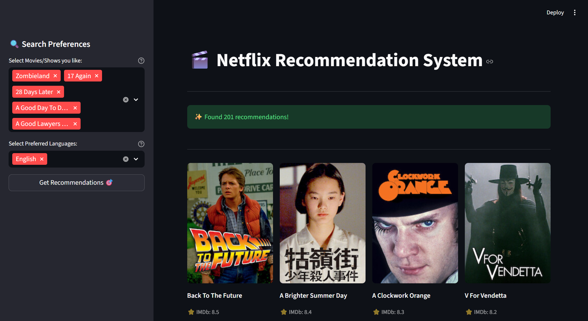
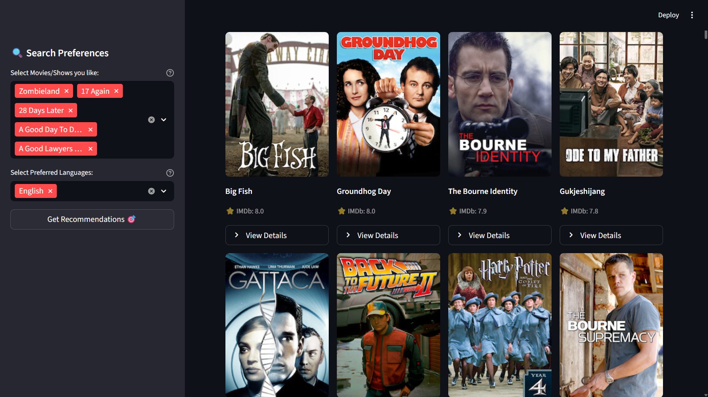

# Netflix-Recommendation-System-Streamlit-Version

# 🎬 Netflix Recommendation System

A content-based movie and TV show recommendation system built with Streamlit and Machine Learning. This application analyzes movie metadata including genres, tags, actors, and viewer ratings to suggest similar content based on your preferences.






## ✨ Features

- **Intelligent Recommendations**: Get personalized movie/show suggestions based on content similarity
- **Multi-Selection Support**: Select up to 5 titles to get combined recommendations
- **Language Filtering**: Filter recommendations by preferred languages
- **Beautiful UI**: Clean, responsive grid layout with movie posters and details
- **Fast Performance**: Cached data processing for quick results
- **IMDb Integration**: Shows IMDb scores for quality assessment

## 🚀 Demo

The app provides:
- Visual movie cards with posters
- Expandable details for each recommendation
- Real-time filtering by language preferences
- Sorted results by IMDb scores

## 📋 Prerequisites

- Python 3.8 or higher
- pip package manager

## 🛠️ Installation

1. **Clone the repository**
```bash
git clone https://github.com/yourusername/netflix-recommendation-system.git
cd netflix-recommendation-system
```

2. **Create a virtual environment** (recommended)
```bash
python -m venv venv
source venv/bin/activate  # On Windows: venv\Scripts\activate
```

3. **Install dependencies**
```bash
pip install -r requirements.txt
```

4. **Prepare your dataset**
   - Place your `NetflixDataset.csv` file in the project root directory
   - The dataset should contain columns: `Title`, `Genre`, `Tags`, `Languages`, `Actors`, `View Rating`, `IMDb Score`, `Image`

## 📁 Project Structure

```
Netflix-Streamlit-App/
├── streamlit_app.py      # Main application file
├── NetflixDataset.csv    # Netflix dataset (not included)
├── requirements.txt      # Python dependencies
├── README.md            # Project documentation
└── .gitignore           # Git ignore file
```

## 🎯 Usage

1. **Run the Streamlit app**
```bash
streamlit run streamlit_app.py
```

2. **Access the app**
   - Open your browser and navigate to `http://localhost:8501`

3. **Get recommendations**
   - Select one or more movies/shows from the sidebar
   - (Optional) Filter by preferred languages
   - Click "Get Recommendations 🎯"
   - Browse through the recommended titles

## 🔧 Configuration

### Dataset Format

Your CSV file should include these columns:
- `Title`: Movie/show name
- `Genre`: Comma-separated genres
- `Tags`: Descriptive tags
- `Languages`: Available languages
- `Actors`: Cast members
- `View Rating`: Age rating (e.g., PG-13, R)
- `IMDb Score`: Rating out of 10
- `Image`: URL to poster image

### Customization

You can modify these parameters in `streamlit_app.py`:

```python
max_selections=5  # Maximum titles to select
cols_per_row = 4  # Grid columns for display
sim_scores[1:51]  # Number of recommendations to generate
```

## 🧠 How It Works

1. **Data Processing**: Loads and cleans the Netflix dataset
2. **Feature Engineering**: Combines genre, tags, actors, and ratings into a text "soup"
3. **Vectorization**: Uses CountVectorizer to convert text to numerical features
4. **Similarity Calculation**: Computes cosine similarity between all titles
5. **Recommendation**: Returns titles with highest similarity scores

## 📦 Dependencies

```txt
streamlit==1.29.0
pandas==2.1.3
scikit-learn==1.3.2
numpy==1.24.3
```

## 🚀 Deployment

### Deploy to Streamlit Cloud

1. Push your code to GitHub
2. Visit [streamlit.io/cloud](https://streamlit.io/cloud)
3. Connect your repository
4. Deploy!

**Note**: Ensure `NetflixDataset.csv` is included in your repository or use Streamlit secrets for data storage.

### Environment Variables

No environment variables required for basic functionality.

## 🤝 Contributing

Contributions are welcome! Please feel free to submit a Pull Request.

1. Fork the project
2. Create your feature branch (`git checkout -b feature/AmazingFeature`)
3. Commit your changes (`git commit -m 'Add some AmazingFeature'`)
4. Push to the branch (`git push origin feature/AmazingFeature`)
5. Open a Pull Request

## 📝 License

This project is licensed under the MIT License - see the [LICENSE](LICENSE) file for details.

## 🐛 Known Issues

- Image URLs may be broken if dataset contains invalid links
- Large datasets may take longer to load initially (cached after first load)

## 💡 Future Enhancements

- [ ] Add collaborative filtering
- [ ] Implement user ratings and feedback
- [ ] Add advanced filters (year, duration, type)
- [ ] Include trailers and streaming links
- [ ] Export recommendations as PDF/CSV
- [ ] Add dark/light theme toggle

## 📧 Contact

Your Name - [@yourtwitter](https://twitter.com/yourtwitter) - email@example.com

Project Link: [https://github.com/yourusername/netflix-recommendation-system](https://github.com/yourusername/netflix-recommendation-system)

## 🙏 Acknowledgments

- [Streamlit](https://streamlit.io/) for the amazing framework
- [scikit-learn](https://scikit-learn.org/) for ML algorithms
- Netflix for inspiration
- The open-source community

---

Made with ❤️ using Streamlit | Powered by Machine Learning